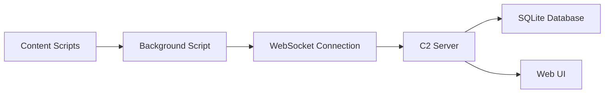

# ChromeControl

  

A sophisticated Chrome extension command & control system enabling real-time browser data collection and control capabilities.

## 🔍 Overview

ChromeControl is a comprehensive browser monitoring system that combines a Chrome extension with a command & control server featuring a web interface. This powerful tool enables real-time data collection and browser control across multiple clients.

## ⭐ Features

### 🔌 Extension Capabilities

- 🌐 Browser data access through Chrome Extension API
- ⚡ Site content replacement (phishing capabilities)
- ⌨️ Precise keystroke capture with timing data
- 📝 Form submission capture
- 💾 localStorage monitoring
- 📄 Content script injection in all tabs
- 🔧 Remote JavaScript execution within browser context

### 🎯 Command & Control Server

- 🖥️ Modern web interface for client monitoring
- ⚡ Real-time communication via WebSockets
- 👥 Multi-client management
- 🗄️ SQLite database for data storage
- ⏺️ Advanced keystroke replay functionality
- 🔄 Remote command execution

### Injector Executable 💉

- Force installs extension into Chrome browser
- Uses enterprise policy registry keys
- Automated browser extension deployment
- Persistence mechanisms

## 🏗️ Technical Architecture

### Data Flow

1. Content scripts collect data in each tab
2. Data is sent to background script via Chrome messaging API
3. Background script aggregates data from all sources
4. WebSocket connection maintains real-time communication with C2 server
5. Server processes and stores collected data in SQLite
6. Web UI provides real-time monitoring and control through WebSocket events

## 🚀 Planned Features

### 📜 Script Execution

- Client-side script execution capabilities
- Support for userscripts integration

[More features to be added]

## 🛠️ Installation & Setup

[Setup instructions to be added]

## 👥 Contributing

[Contribution guidelines to be added]

## 📋 Todo List

### General

- [x] make an injector to force install the extension/payload
- [x] make a payload builder which builds the extension for a target url and config
- [ ] make a setup script
- [ ] add use instructions
- [ ] add setup instructions
- [ ] add more actions (ddos, redirect, etc)
- [ ] add more options to the payload builder
- [ ] figure out a way to do the proxying

### Server

[To be populated]

### WebUI

[To be populated]

### Extension

[To be populated]

---

This project is licensed under the Apache License 2.0. See the [LICENSE](LICENSE) file for details.
